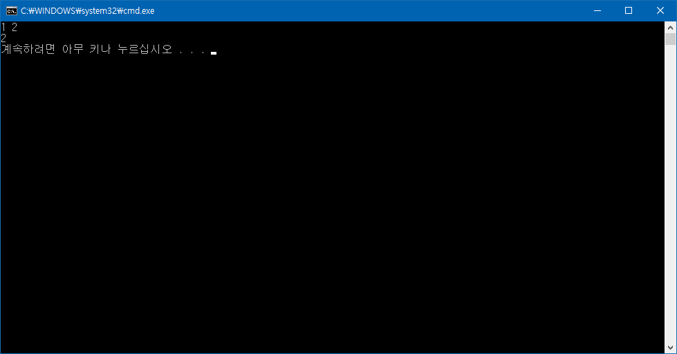
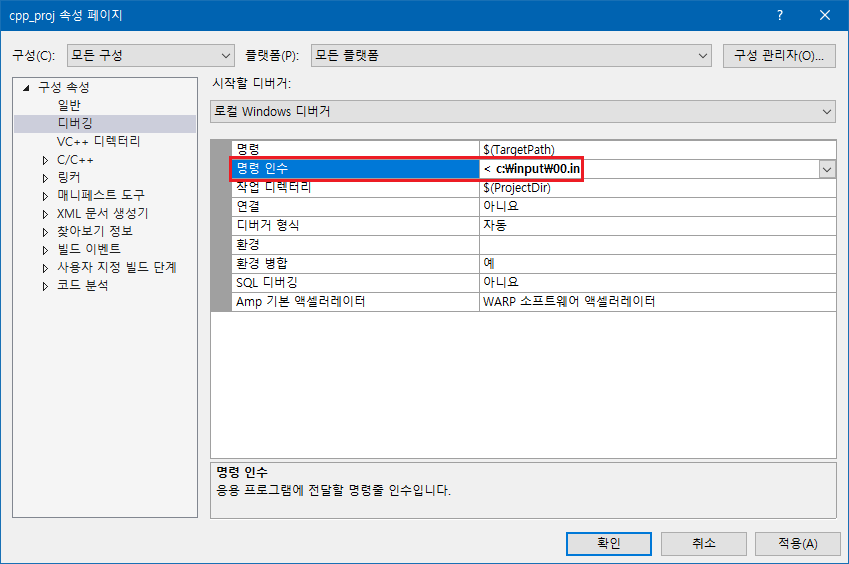

<script>
document.children[0].children[1].children[0].children[0].remove()
</script>
<!--BEGIN-->

# 개발 도구 사용 안내

코드 작성시 디버깅과 편의를 위해 로컬 컴퓨터의 개발 도구를 사용할 수 있습니다.

이 경우 로컬 컴퓨터에서의 개발 환경과 채점에서의 개발 환경이 달라 실행이나 채점이 되지 않는 불이익이 없도록 본 안내를 꼭 읽어보시기 바랍니다 (특히 Visual Studio / Visual C++ 사용시).

## 채점 환경

코드 제출 문제의 작성된 코드의 실행과 채점은 채점사이트의 실행 환경을 기준으로 판단하므로, 
채점사이트의 실행 환경에서도 실행할 수 있도록 유념하여 개발 도구를 사용해주시기 바랍니다.

채점사이트의 실행 환경은 아래와 같습니다:

| 언어 | 버전 및 실행 환경 (ubuntu)| 컴파일러 옵션 |
|---|---|---|
| C | GNU C: gcc 5.4.0 | `-O2 -static` |
| C 11 | GNU C: gcc 5.4.0 | `-O2 -static --std=c11` |
| C++ | GNU C++: g++ 5.4.0 | `-O2 -static` |
| C++ 11 | GNU C++: g++ 5.4.0 | `-O2 -static --std=c++11` |
| C# | Mono C# compiler version 4.2.1.0 | `-warn:0 -optimize+ -r:System.Numerics` |
| JavaScript | Node.js v6.11.2 | |
| Java | Oracle Java 8u144 | |
| Python 2 | 2.7.12 | |
| Python 3 | 3.5.2 | |

아래의 예시처럼 특정 플랫폼(특히, Windows나 Visual C++)에서만 동작하는 코드를 작성하지 않도록 유의하시기 바랍니다.

|사용금지 예시|비고|
|---|---|
|`void main()`|  표준에 따라 `int main`이어야 함|
|`getch()`| 대신 `getchar()`를 사용|
|`fflush(stdin)` | 비표준|
|`GetTickCount()` | Windows API 는 사용할 수 없음|
|`CString`| `CString` 은 표준이 아니며 사용할 수 없음. 대신 `std::string` 을 사용|
|`#include <stdafx.h>`|`stdafx.h` 는 Visual C++ 전용 precompiled header 임|

## Visual Studio / Visual C++ 사용

Visual Studio 를 사용할 경우 Visual Studio Community 2017 사용을 권장합니다. Visual Studio Community 2017 은 아래의 URL 에서 다운로드 받을 수 있습니다.

<a href='https://www.visualstudio.com/ko-kr/products/visual-studio-community-vs.aspx' target='_blank'>[https://www.visualstudio.com/ko-kr/products/visual-studio-community-vs.aspx]</a>

### Visual Studio 에서 프로젝트 만들기

Visual Studio 에서 C++ 또는 C# 을 이용하여 프로그램을 작성할 경우 새 프로젝트에서 "콘솔 응용 프로그램" 을 선택하여 작성해야합니다.
이 때, C++ 의 경우 응용 프로그램 설정에서 "미리 컴파일된 헤더 (Precompiled Header)" 를 사용하지 않도록 해야합니다.

아래에서 Visual Studio 2017 용 기본 프로젝트 파일을 받아 `Main.cpp` 또는 `Main.cs` 를 수정하여 사용할 수 있습니다.

* [C++ 기본 프로젝트](cpp_proj.zip)
* [C# 기본 프로젝트](cs_proj.zip)

### 프로그램의 출력 확인

프로그램을 실행 할 때 콘솔 창이 닫히면서 출력을 확인하기 힘들 경우,
Ctrl+F5 를 누르면 프로그램이 끝나고 콘솔창이 닫히기 전에 잠시 멈추어 결과를 확인할 수 있습니다.



### 파일을 입력으로 전달하기

로컬 컴퓨터에서 실행해 볼 때, 입력을 실행 때마다 직접 입력하는 대신 파일의 내용을 입력할 수 있습니다.
문제에 적힌 입력 예제를 복사하여 텍스트 파일로 저장하고,
해당 파일의 경로를 프로젝트 속성의 디버깅 / 명령 인수 항목에 `< c:\input\00.in` 와 같이 입력하면 `c:\input\00.in` 파일을 프로그램의 표준입력으로 주면서
Visual Studio 에서 프로그램을 실행해 볼 수 있습니다.



혹은, 콘솔(명령 프롬프트) 창에서 직접 컴파일된 exe 파일 뒤에 "`exe파일명` < `입력파일명`" 을 입력하여도 실행해 볼 수 있습니다.


## 표준 입출력 사용하기

모든 코드 제출 문제에서는 주어진 입력 형식에 따라 표준 입력 (standard input)으로 입력을 받고 주어진 출력 형식에 따라 표준 출력(standard output)으로 출력해야 합니다.

아래 예시와 같이 두 개의 정수를 받아 곱하여 출력해야 하는 문제가 있다면, 언어별로 표준 입력과 표준 출력을 처리하는 방법은 아래와 같습니다.

### 입력 예시

```
8 4
```

### 출력 예시

```
32
```

### C

```
#include <stdio.h>

int main()
{
	int a, b;
	scanf("%d %d", &a, &b);
	printf("%d\n", a * b);
	return 0;
}
```

### C++

```
#include <iostream>

using namespace std;

int main()
{
	int a, b;
	cin >> a >> b;
	cout << a * b << endl;
	return 0;
}
```

### C&#35;

```
using System;

public class Program {
    public static void Main() {
        string s = Console.ReadLine();
        string[] arr = s.Split();
        int a = int.Parse(arr[0]);
        int b = int.Parse(arr[1]);
        Console.WriteLine(a * b);
    }
}
```

### JavaScript (node.js)

```
var input = '';
process.stdin.resume();
process.stdin.on('data', function(data) {
    input += data;
});
process.stdin.on('end', function() {
    input = input.split(/\s+/);
    console.log(parseInt(input[0]) * parseInt(input[1]));
});
```

### Java

```
import java.util.*;
public class Main{
    public static void main(String args[]){
        Scanner sc = new Scanner(System.in);
        int a, b;
        a = sc.nextInt();
        b = sc.nextInt();
        System.out.println(a * b);
    }
}
```

### Python

```
s = raw_input()
arr = split()
a = int(arr[0])
b = int(arr[1])
print a*b
```

### Python 3

```
s = input()
arr = s.split()
a = int(arr[0])
b = int(arr[1])
print(a*b)
```

## 프로그램의 종료 코드 (exit code)

작성된 프로그램은 exit code 0 으로 종료하여야 합니다. exit code 가 0 이 아닐 경우 맞는 답을 출력하는 프로그램을 제출하였더라도 채점이 되지 않을 수 있습니다. 많은 언어에서, `main()`이 0을 리턴하는 것으로 해결됩니다.

<!--END-->
